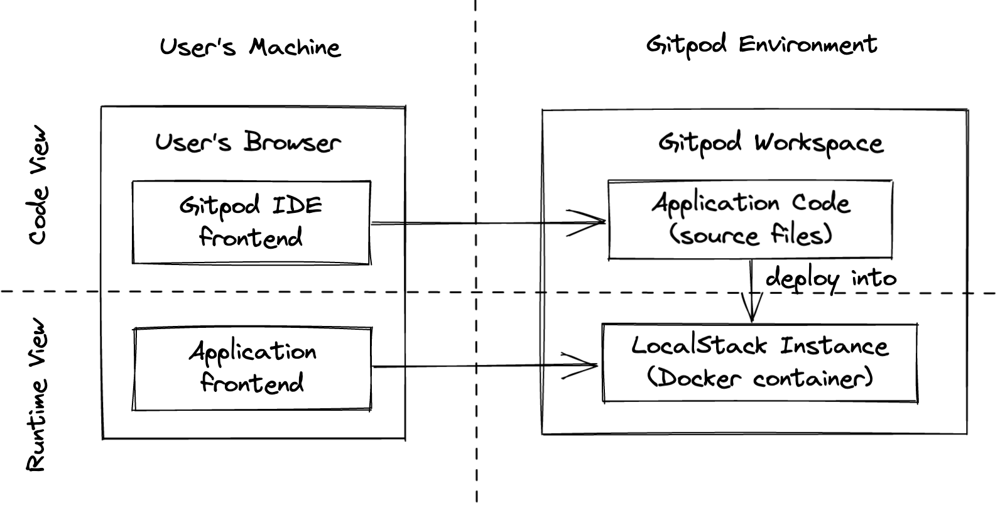
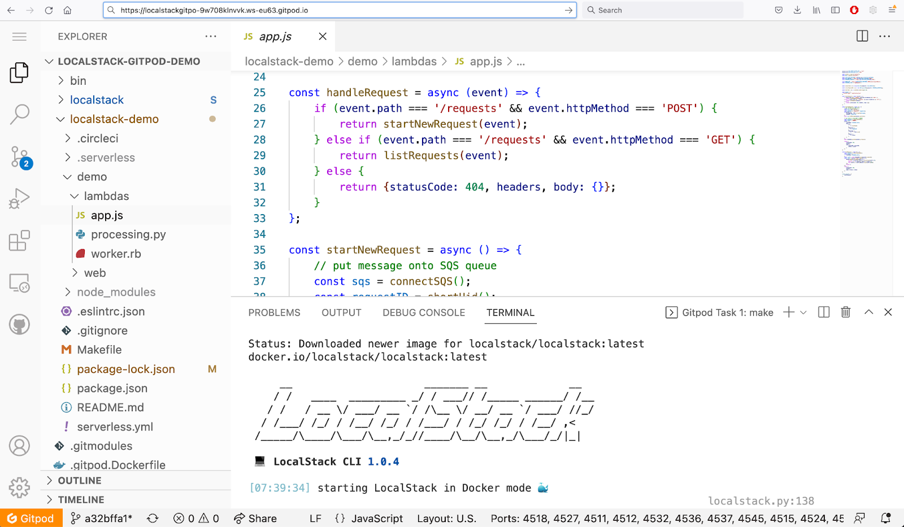
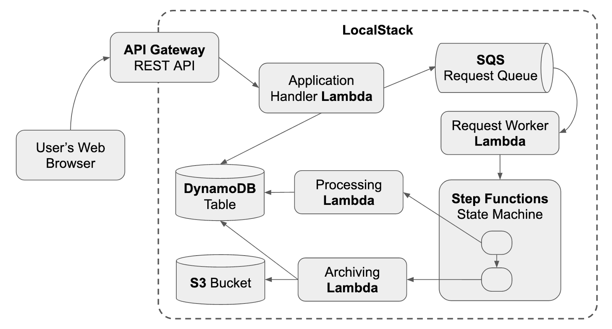
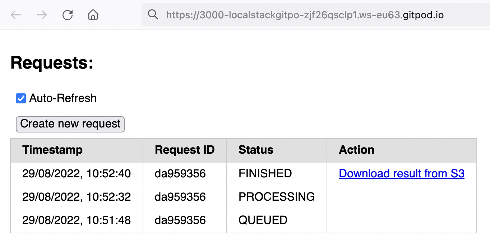

Shipping applications to production requires them to be battle-tested in the dev environment. The dev environment should mimic the production environment as closely as possible. This comes with a cost: testing cloud applications is cumbersome as they have many moving parts. For instance, if you build a simple lambda function, you might use services such as CloudWatch, S3, IAM, etc.

Imagine configuring your project and provisioning these cloud resources in a test environment every time for developing new features. It’s a tiring and time-consuming cycle 😫. This makes the whole development and test feedback loop slow.

Developing and running cloud applications is simplified with Gitpod and LocalStack ✨
Gitpod’s fully automated, ephemeral workspaces provide a great developer experience. When you open a new workspace, all the required tools and packages get installed. You can also parallelly work on features in multiple ephemeral workspaces, which can be shared with your peers. LocalStack accelerates your dev and test feedback loop. It provides you with a fully functional local AWS cloud stack that gives immediate feedback on your changes without waiting on cloud resources. This saves you time and resources.

In this blog, we will learn more about the combined power of LocalStack x Gitpod.

- What are LocalStack and Gitpod
- The powerful user experience when developing and running cloud applications
- Building demo application
- Key Benefits

# What is LocalStack?

LocalStack is a cloud development platform that aims to turbocharge dev&test feedback loops, team collaboration, and easily reproducible ephemeral cloud environments. At its core, LocalStack provides a fully functional local AWS cloud stack that ships as a Docker image and provides some 70+ high-quality emulated cloud services (e.g., Lambda, S3, DynamoDB, etc). With LocalStack, cloud applications can be developed and executed entirely on your local machine, or in a CI pipeline or other ephemeral environment, without ever talking to the real cloud, reducing dev&test cycles from minutes to seconds.

LocalStack offers entirely new ways for local debugging of Lambdas and containerized apps (e.g., ECS/EKS), as well as some advanced new features that can radically improve productivity and team collaboration patterns.

There is also a large and growing ecosystem of tools that LocalStack natively integrates with - from Infrastructure-as-Code (IaC) frameworks like Terraform or Pulumi, to application frameworks like Serverless or Architect, to a whole suite of tools provided by AWS itself (CDK, SAM, Copilot, Chalice, etc).

# What is Gitpod ?

Gitpod is an open-source remote development platform for remote development. It provides an automated setup with cloud-based, remote developer environments connected with a developer’s [editing experience of choice](https://www.gitpod.io/docs/ides-and-editors), making developer experiences better.

Rather than having a single static environment (like your local machine), Gitpod encourages you to codify your dev environment as code. With your project codified, you’ll be able to spin up a new workspace, start coding and throw away the workspace when you’re done. You can have multiple workspaces with different contexts open at once - one for your feature, one for a bug or one for your code review directly in Gitpod.

You can also deploy Gitpod on your infrastructure with [Gitpod Self hosted](https://www.gitpod.io/self-hosted). Gitpod supports different cloud providers, self-managed Kubernetes clusters, corporate firewalls, and even off-grid / air-gapped networks.

# How it works: the combined power of LocalStack and Gitpod

Combining the development environment of Gitpod with the cloud sandbox provided by LocalStack results in a powerful user experience to minimize friction when developing cloud applications and getting up and running with cloud development within literally a few minutes.

The figure is also segmented vertically - in the upper part, we see the code view, i.e., the Gitpod IDE available in your browser that allows you to conveniently work on your application code. You can also [use your favorite IDE](https://www.gitpod.io/docs/ides-and-editors) from JetBrains, VS Code as your editor, or even vim.

The lower part contains the runtime view, i.e., an instantiation of your app that can be used for previewing the application logic and quickly iterating on the logic. The runtime makes use of a LocalStack container that runs inside the Gitpod environment - and allows you to conveniently deploy your cloud application assets into this sandbox, to then preview the results.

The screenshot below illustrates how things fit together when spinning up this Gitpod workspace. In the tree view on the left-hand side of VS Code in the browser, we can see the files of your application. The main view shows the source code of your app (e.g., an AWS Lambda handler file), and the terminal view in the lower part shows the log output of the LocalStack Docker instance running in the environment.

This setup gives us the full power of a cloud development environment where we can develop our AWS cloud app - without the need for any local installation whatsoever, and without ever talking to the real cloud (hence, not incurring any cloud costs).

Gitpod automates the steps for installation of your tools and packages and ensures servers and processes are running, enabling you to develop your cloud application on multiple ephemeral workspaces.LocalStack helps you to test and deploy your cloud application by emulating the AWS cloud services.

Let’s dive into a concrete example in a bit more detail in the next section 🚀

## Example Scenario - Sample application on LocalStack x Gitpod

We demonstrate a sample application, provided as an open source project (https://github.com/whummer/localstack-gitpod-demo), that illustrates how cloud apps can be seamlessly developed using Gitpod and LocalStack.

The goal of this example is to develop an AWS cloud application that represents a classical asynchronous request worker pattern. Below is a simplified architecture diagram of the application that shows the different components of the application, and how they fit together:

> Note: This is a simplified and synthetic application for demonstration purposes, but it is easy to see that a similar application architecture could be used for different real-life purposes - e.g., in a helpdesk application that processes user requests, or some order fulfillment system that processes purchases of a customer. The key part is - even though the application will eventually be deployed on AWS cloud, we can develop and run this entire application with LocalStack running in Gitpod, without ever interacting with a costly production environment in the cloudthe real cloud.

Once deployed on LocalStack, the sample application will spin up a simple Web user interface to create user requests, which are then processed by the application logic. The timestamps and status updates can be seen in the screenshot below - notice how the request is passing through the different stages - from QUEUED, to PROCESSING, to FINISHED.

> Note that - in order for the request to go through these stages, it follows all the steps outlined above - entering through an API Gateway, being processed by an application handler Lambda function that puts a new item to an SQS queue, being picked up by another Lambda that starts a StepFunctions state machine workflow with two steps - a processing Lambda that updates the state in a DynamoDB table, and an archiving Lambda that puts the final result to an S3 bucket, making it available for download by the user. All the steps of this non-trivial application are being executed within the LocalStack container, running in the Gitpod environment.

## Technical Details

Let’s dive into some of the technical details of this example, and how to run the sample cloud application entirely within the Gitpod environment, using LocalStack.

1. First open the sample application in Gitpod Workspace.
2. On opening the demo, `gitpod.yml` configures the project by installing the tools and running the app.
3. Upon deployment, the sample app opens a network port 3000 that serves the Web application of the example.
4. Gitpod opens the demo app in the browser that sends API requests to the LocalStack edge endpoint on http://localhost:4566, which then gets forwarded to the LocalStack instance running within the remote Gitpod environment.

Congratulations 🎉 Now, you are ready to develop and run cloud applications using Gitpod and LocalStack. You can also watch the following video, which thoroughly walks you through the whole process:

`youtube: CihxsFcHyEk`

## Key Benefits

There are a number of key benefits of using Gitpod and LocalStack to develop cloud applications:

- **Reproducibility:** The setup with the Gitpod workspace running LocalStack makes it extremely easy to create a reproducible environment with all application artifacts pre-configured, allowing team members to become productive within literally a few minutes.
- **Collaboration:** You can also share running workspaces which makes it possible to quickly look at a workspace together with a (remote) colleague. You can read more about it in Collaboration & Sharing of Workspaces doc.
- **Seamless transition into CI:** The application configuration can be taken 1:1 and directly transferred to a CI/CD pipeline that deploys the application and executes integration tests to ensure quality, as the business logic of the cloud app evolves over time.
- **Cost savings:** Last but not least, it becomes very easy to run your applications in a sandbox environment, without ever talking to the real cloud, hence not incurring any costs for using any of the real cloud resources.

If you have any questions about configuring and running your project, drop by Gitpod’s [community Discord server](https://discord.com/invite/gitpod) or LocalStack [Slack Community](https://localstack-community.slack.com/). We would love to hear your feedback in the Community.
